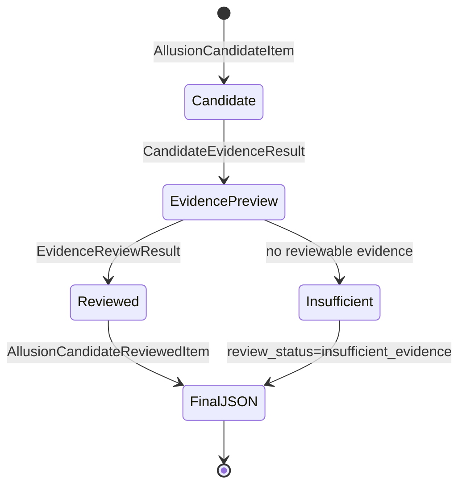

# Allusion Schema State Map

这份文档只解释 `app/schemas/allusion.py` 中三类状态对象的分工，不修改 schema。

## 候选是什么

候选对应 `AllusionCandidateItem`【Pydantic 模型 / 候选识别结果】。

它表示“这段原文值得后续查”，还不是证据结论。候选来自整首词的 LLM 识别，字段里保存：

- `line_no`：候选所在原句编号。
- `line_text`：候选所在原句。
- `anchor_text`：原文中可点击、可回填的锚点。
- `candidate_type`：候选类型，例如典故、文献化用、历史地名。
- `query` / `query_variants`：后续查证时使用的查询词。
- `reason`：为什么值得查。
- `confidence`：候选识别阶段的置信度。

它解决的是“从整首词里挑出哪些点需要查证”。

## 证据结果是什么

证据结果对应 `CandidateEvidenceResult`【Pydantic 模型 / 单次查证结果】和 `AllusionCandidateEvidenceItem`【Pydantic 模型 / 候选加证据预览】。

`CandidateEvidenceResult` 表示“某个查询词在某个 CNKGraph 工具里查了一次”的结果，包含：

- `source`：使用哪个证据来源，例如典故候选或出处与化用。
- `query_used`：实际使用的查询词。
- `status`：这一次查询是命中、无结果还是错误。
- `hit_count` / `displayed_count` / `truncated`：命中数量、展示数量和是否截断。
- `items`：可展示的窄证据条目。
- `error`：局部错误信息。

`AllusionCandidateEvidenceItem` 在候选上追加 `evidence_results` 和 `overall_status`，表示这个候选经过多次查询后的整体查证状态。

它解决的是“候选有没有外部候选证据、证据从哪里来、能展示哪些窄字段”。

## 审阅结果是什么

审阅结果对应 `EvidenceReviewResult`【Pydantic 模型 / 单候选审阅结论】和 `AllusionCandidateReviewedItem`【Pydantic 模型 / 候选加审阅结果】。

`EvidenceReviewResult` 表示 Reviewer 对一个候选的已有证据做出的受控判断，包含：

- `review_status`：这个候选是否能生成审阅短注，或证据不足、有歧义、审阅失败。
- `confidence`：Reviewer 对本次审阅结论的置信度。
- `short_note`：只基于最佳证据生成的短注；不是最终人工定论。
- `best_evidence`：可支撑短注的最佳证据。
- `downgraded_evidence`：有关系但不能作为最佳证据的条目。
- `rejected_evidence`：误命中或无关条目。
- `caveat`：证据不足或有歧义时的说明。

它解决的是“查到的候选证据能不能支撑一个谨慎短注”。

## review_status / role / relevance 分别解决什么问题

`review_status`【枚举 / 候选级状态】回答“这个候选整体能不能出审阅结论”。

- `reviewed`：有合格最佳证据，并生成了短注。
- `insufficient_evidence`：现有证据不足，不能生成可靠短注。
- `ambiguous`：证据有一定相关性，但关系不够清楚。
- `error`：审阅过程失败，通常是单候选局部失败。

`role`【枚举 / 证据角色】回答“这条证据和当前作品是什么关系”。

- `prior_source`：前代来源，可能支撑典故或化用判断。
- `current_work_self_hit`：当前作品自命中，不能拿原句证明原句。
- `later_reuse`：后代沿用，只能说明后世使用，不能证明当前词的来源。
- `weak_related`：弱相关，可能同词、近义或语境较远。
- `irrelevant`：无关或误命中。
- `unknown`：关系不明。

`relevance`【枚举 / 相关度】回答“这条证据和候选锚点贴合到什么程度”。

- `strong`：强贴合。
- `medium`：中等贴合。
- `weak`：弱贴合。
- `none`：不相关。

三者分工不同：`review_status` 是候选整体结论，`role` 是证据与当前作品的时序/关系，`relevance` 是证据内容与候选锚点的贴合度。

